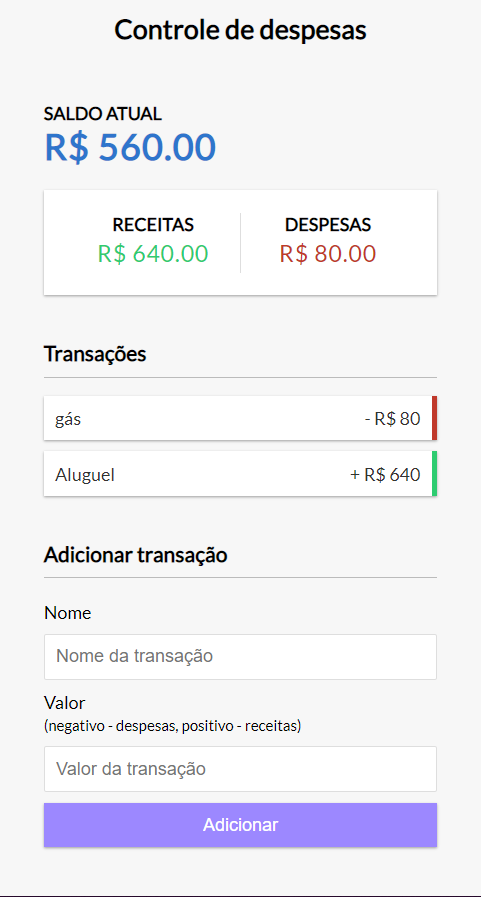

# Controle financeiro simples.

Após uma aula do intrututor Roger Melo, foi possivel fazer um controle financeiro simples, ja usando um templete pronto com css e html,
realizando as operações com JavaScript puro, com boas praticas de programação.

## Abaixo um print de como ficou a aplicação final.

          
                                       

